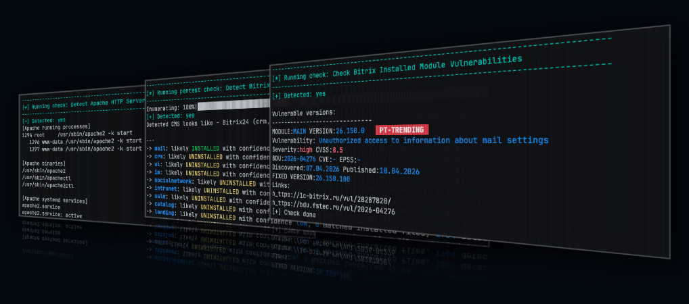
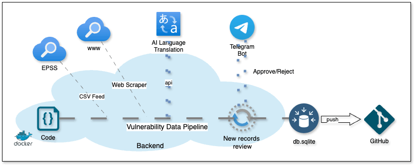

# BitrixProbe




BitrixProbe is a vulnerability assessment tool for CMS 1C-Bitrix/Bitrix24 installations. It is written in Python. 

It is designed around two separate assessment modes:
- `pentest`: external HTTP/HTTPS checks against a target URL.
- `audit`: authenticated local server checks over SSH.


### Legal Disclaimer & Responsible Use

BitrixProbe is intended only for authorized security testing, internal audits, research, and defensive assessment.

Please see [DISCLAIMER](./DISCLAIMER.md) for the full legal disclaimer.


## Why I Built BitrixProbe

I started BitrixProbe after facing a recurring problem in vulnerability scanning and remediation approval.

Bitrix-based systems are often heavily modified by web developers and integrators. These custom changes can make 
remediation slow, risky, or difficult to approve, especially in corporate environments where business logic 
depends on legacy code and custom modules.

As a result, vulnerable code exist in production for a long time. In many cases, security teams do not have 
enough visibility into which Bitrix components are exposed, which modules are installed, or which issues 
require urgent attention.

The first idea behind BitrixProbe was simple: build a small Python tool that keeps external web checks and 
authenticated server-side checks separate, collects useful evidence, and produces reports that are practical 
during real security assessments.

BitrixProbe is still evolving. Some checks focus on fingerprinting and exposure detection, while others are 
designed as vulnerability-specific probes or local audit checks.


## Modes

| Mode | Description | Authentication | Typical Use |
| --- | --- | --- | --- |
| `pentest` | External HTTP/HTTPS checks against a target URL. | Not required | Public exposure checks, fingerprinting, unauthenticated probes. |
| `audit` | Local server checks over SSH. | Required | Installed module checks, local configuration review, version comparison. |


## Tested Environment

BitrixProbe is developed and tested in a controlled lab environments.

| Target OS                                          | PHP Version | Web Server | Bitrix Version / Edition |
|----------------------------------------------------| --- | --- | -- |
| Ubuntu 24.04.4 LTS Linux 6.8.0-117-generic aarch64 | PHP 8.3.6 | Apache/2.4.58 | 1C-Bitrix/Bitrix24 26.150.0 |


## Features

- Enumeration modules to support penetration tests and audit assessments.
- External Bitrix checks over HTTP and HTTPS.
- Authenticated local server audit checks over SSH.
- Standard result format for every module.
- Context sharing between modules for structured evidence.
- Plain text report generation.
- Local vulnerability database updated every day.
- Python module architecture.


## Installation

Clone the repository and install the Python dependencies from the project root:

```bash
git clone https://github.com/ErSilh0x/bitrixprobe.git
cd bitrixprobe
python3 -m venv .venv
source .venv/bin/activate
pip install -r requirements.txt
```

Run BitrixProbe from the repository root:

```bash
python -m bitrixprobe --help
```


## Usage

Run external pentest checks:

```bash
python -m bitrixprobe pentest --url https://example.com
```

Run authenticated server-side audit checks over SSH:

```bash
python -m bitrixprobe audit \
  --host 192.168.56.10 \
  --port 22 \
  --user ubuntu \
  --webroot /var/www/bitrix
```

Reports are saved to the `reports/` directory by default.


### Environment File

BitrixProbe can read SSH audit connection settings from a `.env` file. This is
useful for audit mode because the SSH password is not accepted as a command-line
argument.

Create a `.env` file in the project root:

```env
BP_SSH_HOST=192.168.56.10
BP_SSH_PORT=22
BP_SSH_USER=ubuntu
BP_SSH_PASSWORD=change-me
```

Set strict file permissions before running audit mode:

```bash
chmod 640 .env
```

BitrixProbe checks the `.env` file permissions before loading it. The file must
not be a symlink, and the expected permission mode is `640`. If the file has
different permissions, BitrixProbe stops and prints the required `chmod` command.

Use the default `.env` file:

```bash
python -m bitrixprobe audit --webroot /var/www/bitrix
```

Use a custom environment file:

```bash
python -m bitrixprobe audit \
  --env-file ./lab.env \
  --webroot /var/www/bitrix
```

CLI values override `.env` values for SSH host, port, and username:

```bash
python -m bitrixprobe audit \
  --host 192.168.56.20 \
  --port 2222 \
  --user bitrix \
  --env-file .env \
  --webroot /var/www/bitrix
```

If host, port, username, or password are still missing after reading CLI options
and the `.env` file, BitrixProbe asks for them interactively.


### Options

Show the main help:
```bash
python -m bitrixprobe --help
```

Show pentest mode help:
```bash
python -m bitrixprobe pentest --help
```

| Option | Required | Description |
| --- | --- | --- |
| `--url` | Yes | Target URL, for example `https://example.com` or `https://192.168.56.10:8080`. If no scheme is provided, BitrixProbe uses `https://`. |

Show audit mode help:
```bash
python -m bitrixprobe audit --help
```

| Option | Required | Description |
| --- | --- | --- |
| `-H`, `--host` | No | SSH server address. Overrides `BP_SSH_HOST` from the `.env` file. |
| `-p`, `--port` | No | SSH server port. Overrides `BP_SSH_PORT`; defaults to `22` if not provided. |
| `-u`, `--user` | No | SSH username. Overrides `BP_SSH_USER` from the `.env` file. |
| `--env-file` | No | Path to the environment file. Defaults to `.env`. |
| `--webroot` | No | Remote Bitrix webroot directory. Defaults to `/var/www/html`. |
| `--output-dir` | No | Local directory for report files. Defaults to `reports`. |


## Vulnerability List

### Detection status legend

-  — detection is supported.
-  — detection is supported and based on installed/version comparison.
-  — HTTP pentest check works only if vulnerability can be exploited without authentication in non-default CMS installations.
-  — exploitation requires authenticated access in default CMS installations.
-  — vulnerability is a Denial of Service Attack
-  — detection is not implemented yet.


### Detection status

|  Detected  | Title                                                                                                                                                                                                                                              |       Module        | Severity |    BDU     |    CVE     |                                         SSH Audit                                          |                                   Pentest Scan <br/>over HTTP/S                                   |
|:----------:|----------------------------------------------------------------------------------------------------------------------------------------------------------------------------------------------------------------------------------------------------|:-------------------:|:--------:|:----------:|:----------:|:------------------------------------------------------------------------------------------:|:-------------------------------------------------------------------------------------------------:|
|     X      | Exposed Bitrix restore.php backup restore script detection                                                                                                                                                                                         |          X          |    10    |            |            |                      |                             |
|     X      | Exposed Bitrix bitrixsetup.php installer script detection                                                                                                                                                                                          |          X          | Exposure |            |            |                      |                             |
| 08.01.2026 | Local file inclusion when editing a landing page                                                                                                                                                                                                   |       landing       |   9.8    | 2026-05965 |            |  |           |
| 07.04.2026 | Unauthorized access to information about mail settings                                                                                                                                                                                             |        main         |   8.5    | 2026-04276 |            |  |  |
| 30.08.2025 | By filling out a crm form, an attacker can add extraneous content <br/>to the text of linked email newsletters                                                                                                                                     |         crm         |   3.1    | 2025-15620 |            |  |          |
| 21.04.2025 | Local File Inclusion when changing infoblock properties                                                                                                                                                                                            |       iblock        |    8     | 2025-08666 |            |  |             |
| 21.04.2025 | Reading arbitrary files when importing xml info block                                                                                                                                                                                              |       iblock        |   6.9    | 2025-08665 |            |  |            |
| 21.04.2025 | Reading arbitrary files when importing an info block                                                                                                                                                                                               |       iblock        |   6.9    | 2025-08664 |            |  |           |
| 17.04.2025 | Exceeding privileges when editing mail templates                                                                                                                                                                                                   |        main         |   7.1    | 2025-08663 |            |  |           |
| 17.04.2025 | Exceeding the limits when copying files                                                                                                                                                                                                            |       fileman       |   7.1    | 2025-08662 |            |  |          |
| 05.08.2024 | In a virtual machine, it is possible to elevate bitrix->root privileges                                                                                                                                                                            |      vmbitrix       |    8     | 2025-04604 |            |                                |         |
| 16.12.2024 | In a virtual machine, it is possible to elevate bitrix->root privileges                                                                                                                                                                            |      vmbitrix       |    8     | 2025-04539 |            |                                |                  |
| 03.12.2024 | Stored XSS bypassing proactive protection in forum functionality                                                                                                                                                                                   |         ui          |    8     | 2025-00765 |            |  |               |
| 24.04.2024 | (Authenticated) The system administrator can retrieve the previously set password to the proxy server                                                                                                                                              |         dav         |   6,8    | 2024-08613 | 2024-34883 |  |    |
| 24.04.2024 | (Authenticated) The system administrator can retrieve a previously set SMTP password                                                                                                                                                               |        main         |   6,8    | 2024-08612 | 2024-34882 |  |     |
| 24.04.2024 | (Authenticated) The system administrator can retrieve a previously set Exchange password                                                                                                                                                           |         dav         |   6,8    | 2024-08611 | 2024-34891 |  |      |
| 24.04.2024 | (Authenticated) The system administrator can retrieve a previously set SMTP password                                                                                                                                                               |        main         |   6,8    | 2024-08610 | 2024-34885 |  |      |
| 24.04.2024 | (Authenticated) The system administrator can retrieve a previously set Active Directory password                                                                                                                                                   |        ldap         |   6,8    | 2024-08600 | 2024-34887 |  |      |
| 02.07.2024 | (Rejected CVE) If attackers use the virtual machine installer before the administrator does, <br/>they can gain control of the server.                                                                                                             | vmbitrix Ver. 7.5.5 |          | 2024-05252 | 2022-29268 |                                |                                       |
| 07.12.2023 | The bitrixsetup.php installation script did not escape an error message containing user input. <br/>Due to the lack of input parameter validation, it is possible to read files in the operating system.                                           |    bitrixsetup.php    |    3     | 2024-01501 |            |                  |                             |
| 30.03.2023 | (Authenticated) [RCE] Bitrix24 vulnerability related to errors in the data import mechanism. <br/>Exploitation of this vulnerability allows an internal attacker to increase his privileges in the system.                                         |         crm         |   8.8    | 2023-07464 | 2023-1713  |  |           |
| 30.03.2023 | (Authenticated) Stored Cross-Site Scripting [XSS] Bitrix24 vulnerability via Improper Input Neutralization on Invoice Edit Page. Chained with 2023-1716                                                                                            |         crm         |    9     | 2023-07463 | 2023-1715  |  |            |
| 30.03.2023 | Cross-Site Scripting [XSS] The 1C-Bitrix / Bitrix24 Proactive Protection flaw was missing a certain byte sequence <br/>that could be part of an XSS attack. Chained with CVE-2023-1715                                                             |      security       |    9     | 2023-07462 | 2023-1716  |  |     |
| 30.03.2023 | Cross-Site Scripting [XSS] via Client-side Prototype Pollution in <br/>bitrix/templates/bitrix24/components/bitrix/menu/left_vertical/script.js                                                                                                    |        main         |   9.6    | 2023-07461 | 2023-1717  |  |                 |
| 30.03.2023 | (Unauthenticated) [DOS] Denial of Service Vulnerability of 1C-Bitrix web project management system                                                                                                                                                 |        main         |   7.5    | 2023-07460 | 2023-1718  |  |                               |
| 30.03.2023 | (Unauthenticated) Insecure direct object reference [IDOR] - Bitrix24 Insecure Global Variable Extraction in bitrix/modules/main/tools.php                                                                                                          |      intranet       |   7.5    | 2023-07459 | 2023-1719  |  |                          |
| 10.04.2023 | (Unauthenticated) Stored Cross-Site Scripting [XSS] via uploading a crafted HTML file through `/desktop_app/file.ajax.php?action=uploadfile` (Bitrix24 22.0.300)                                                                                   |        main         |   9.3    | 2023-07458 | 2023-1720  |  |                      |
| 30.03.2023 | (Authenticated) [RCE] Bitrix24 vulnerability related to errors in the data import mechanism. <br/>Exploitation of this vulnerability allows an internal attacker to increase his privileges in the system.                                         |        main         |   8.8    | 2023-07457 | 2023-1714  |  |           |
| 30.03.2023 | (Authenticated) [RCE] Bitrix24 vulnerability related to an error in input data processing. <br/>Exploitation of this vulnerability allows an internal attacker to execute <br/>arbitrary code on systems of certain configurations and php version |         crm         |   8.8    | 2023-07457 | 2023-1714  |  |           |
| 13.09.2023 | [RCE] Site content management system (CMS) landing module vulnerability                                                                                                                                                                            |       landing       |    10    | 2023-05857 |            |  |        |
| 28.10.2022 | Site content management system (CMS) vulnerability                                                                                                                                                                                                 |        sale         |   9.8    | 2023-05566 |            |  |              |
| 24.10.2022 | Site content management system (CMS) vulnerability                                                                                                                                                                                                 |       fileman       |   9.6    | 2023-05565 |            |  |                |
| 05.12.2019 | [RCE] Vulnerability in the embedded code editor of the website content management system (CMS)                                                                                                                                                     |        main         |   9.8    | 2023-02793 |            |  |               |
| 28.10.2022 | (Authenticated) Vulnerability in the AD/LDAP server of Bitrix24 business management service <br/>that allows an intruder to gain unauthorized access to protected information.                                                                     |        ldap         |   4.4    | 2023-01604 | 2022-43959 |  |           |
| 04.03.2022 | (Unauthenticated) [RCE] Vulnerability in the "vote" module of the website content management system (CMS)                                                                                                                                          |        vote         |   9.8    | 2022-01141 | 2022-27228 |  |                             |
| 12.10.2020 | Reflected Cross-Site Scripting [XSS] Vulnerability of arParams`[API_KEY]` parameter of map.google component of Bitrix24 <br/>business management service allowing an attacker to execute arbitrary JavaScript code.                                |       fileman       |   9.8    | 2021-03055 |            |  |                                       |
|            | Vulnerability of 1C-Bitrix web project management system                                                                                                                                                                                           |        main         |   4.6    | 2014-00404 |            |                                             -                                              |                                                 -                                                 |
|            | Vulnerability of 1C-Bitrix web project management system                                                                                                                                                                                           |        main         |    10    | 2014-00403 |            |                                             -                                              |                                                 -                                                 |


## Project Architecture

Keeping vulnerability data up to date manually can be time-consuming and error-prone. 
To solve this, I built a simple review-based vulnerability data pipeline that collects data from vulnerability sources, 
normalizes new records, and sends them for manual review before they are 
approved and pushed to GitHub.



## Project Structure

Each security assessment module, registered in the matching `__init__.py` file so the
runner can execute it.

```text    
BitrixProbe/
  bitrixprobe/                    Main Python package and scanner code
    cli.py                         Main CLI entry point
    config.py                      CLI and runtime configuration
    db/                           Local SQLite vulnerability database
    modes/                        Pentest and audit scan runners
        pentest.py                   External HTTP/HTTPS scan runner
        audit.py                     SSH audit runner
    modules/                      Shared clients, report helpers, and checks
      pentest_checks/             External HTTP/HTTPS Bitrix checks
      audit_checks/               Authenticated SSH server-side checks
        www_client.py                Shared HTTP helper functions
        ssh_client.py                Shared SSH helper functions
        out_report.py                Report output helpers
        db_connect.py                Helper functions for connecting to SQLite vulnerability database
    wordlists/                    Wordlists for endpoints, modules, and sensitive files
  reports/                        Generated scan reports
```
